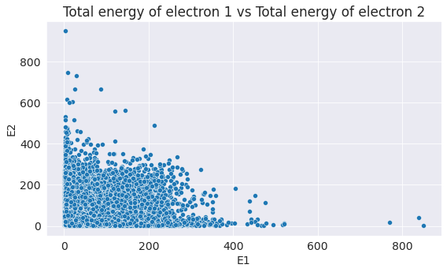
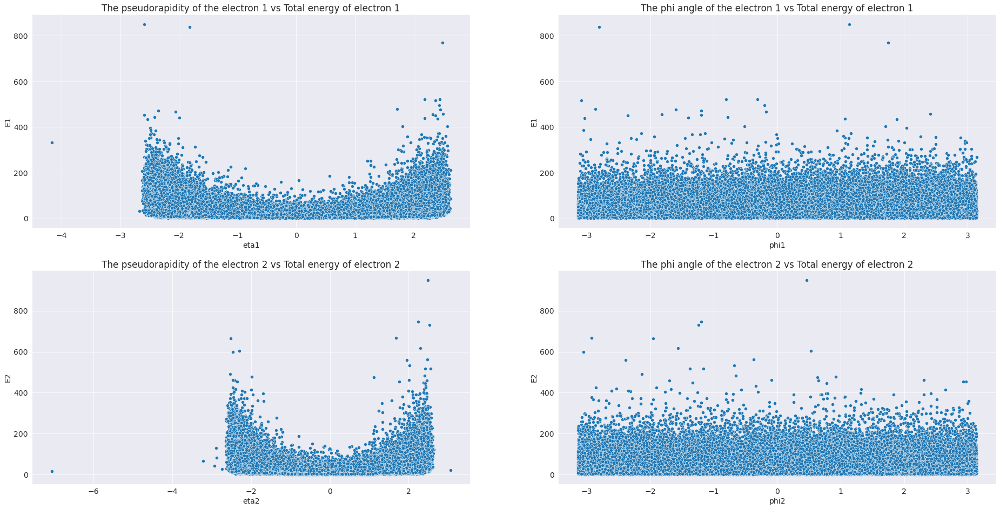
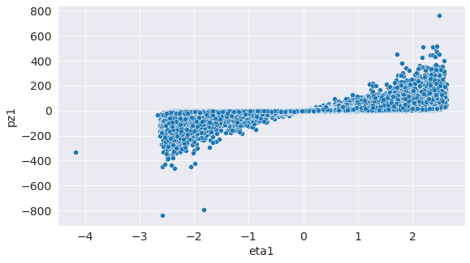
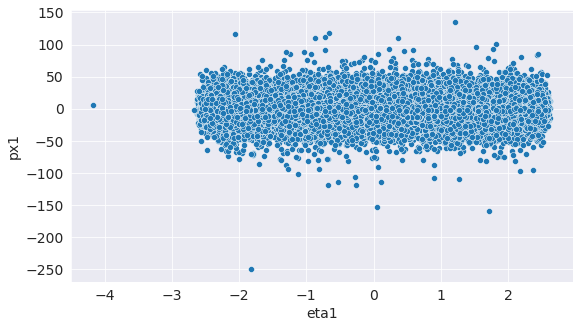
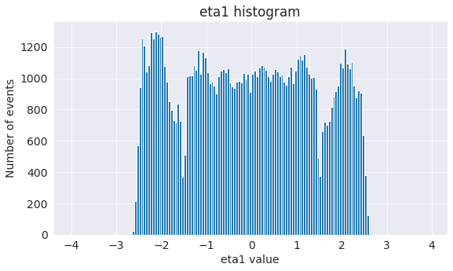
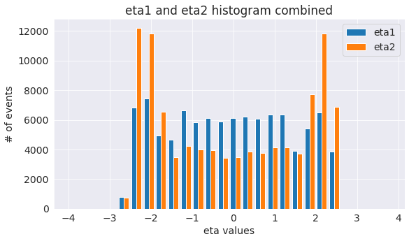
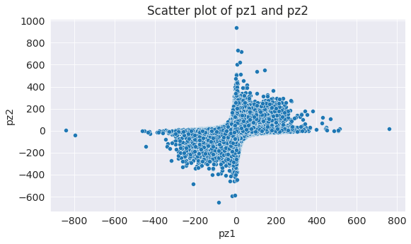

# Data analysis of  "Events with two electrons from 2010" dataset from CERN Open Data

This data set has data associated with events with two electrons from particle physics experiment at CERN in 2010. Read more at: https://opendata.cern.ch/record/304

I will analyze this dataset.

## Data Preparation and Cleaning

Let's inspect data a little bit by .info() and .describe()


```python
import pandas as pd
```


```python
electron_df = pd.read_csv('dielectron.csv')
```


```python
electron_df
```


<div>
<style scoped>
    .dataframe tbody tr th:only-of-type {
        vertical-align: middle;
    }

    .dataframe tbody tr th {
        vertical-align: top;
    }

    .dataframe thead th {
        text-align: right;
    }
</style>
<table border="1" class="dataframe">
  <thead>
    <tr style="text-align: right;">
      <th></th>
      <th>Run</th>
      <th>Event</th>
      <th>E1</th>
      <th>px1</th>
      <th>py1</th>
      <th>pz1</th>
      <th>pt1</th>
      <th>eta1</th>
      <th>phi1</th>
      <th>Q1</th>
      <th>E2</th>
      <th>px2</th>
      <th>py2</th>
      <th>pz2</th>
      <th>pt2</th>
      <th>eta2</th>
      <th>phi2</th>
      <th>Q2</th>
      <th>M</th>
    </tr>
  </thead>
  <tbody>
    <tr>
      <th>0</th>
      <td>147115</td>
      <td>366639895</td>
      <td>58.71410</td>
      <td>-7.311320</td>
      <td>10.531000</td>
      <td>-57.29740</td>
      <td>12.82020</td>
      <td>-2.202670</td>
      <td>2.177660</td>
      <td>1</td>
      <td>11.28360</td>
      <td>-1.032340</td>
      <td>-1.88066</td>
      <td>-11.077800</td>
      <td>2.14537</td>
      <td>-2.344030</td>
      <td>-2.072810</td>
      <td>-1</td>
      <td>8.94841</td>
    </tr>
    <tr>
      <th>1</th>
      <td>147115</td>
      <td>366704169</td>
      <td>6.61188</td>
      <td>-4.152130</td>
      <td>-0.579855</td>
      <td>-5.11278</td>
      <td>4.19242</td>
      <td>-1.028420</td>
      <td>-3.002840</td>
      <td>-1</td>
      <td>17.14920</td>
      <td>-11.713500</td>
      <td>5.04474</td>
      <td>11.464700</td>
      <td>12.75360</td>
      <td>0.808077</td>
      <td>2.734920</td>
      <td>1</td>
      <td>15.89300</td>
    </tr>
    <tr>
      <th>2</th>
      <td>147115</td>
      <td>367112316</td>
      <td>25.54190</td>
      <td>-11.480900</td>
      <td>2.041680</td>
      <td>22.72460</td>
      <td>11.66100</td>
      <td>1.420480</td>
      <td>2.965600</td>
      <td>1</td>
      <td>15.82030</td>
      <td>-1.472800</td>
      <td>2.25895</td>
      <td>-15.588800</td>
      <td>2.69667</td>
      <td>-2.455080</td>
      <td>2.148570</td>
      <td>1</td>
      <td>38.38770</td>
    </tr>
    <tr>
      <th>3</th>
      <td>147115</td>
      <td>366952149</td>
      <td>65.39590</td>
      <td>7.512140</td>
      <td>11.887100</td>
      <td>63.86620</td>
      <td>14.06190</td>
      <td>2.218380</td>
      <td>1.007210</td>
      <td>1</td>
      <td>25.12730</td>
      <td>4.087860</td>
      <td>2.59641</td>
      <td>24.656300</td>
      <td>4.84272</td>
      <td>2.330210</td>
      <td>0.565865</td>
      <td>-1</td>
      <td>3.72862</td>
    </tr>
    <tr>
      <th>4</th>
      <td>147115</td>
      <td>366523212</td>
      <td>61.45040</td>
      <td>2.952840</td>
      <td>-14.622700</td>
      <td>-59.61210</td>
      <td>14.91790</td>
      <td>-2.093750</td>
      <td>-1.371540</td>
      <td>-1</td>
      <td>13.88710</td>
      <td>-0.277757</td>
      <td>-2.42560</td>
      <td>-13.670800</td>
      <td>2.44145</td>
      <td>-2.423700</td>
      <td>-1.684810</td>
      <td>-1</td>
      <td>2.74718</td>
    </tr>
    <tr>
      <th>...</th>
      <td>...</td>
      <td>...</td>
      <td>...</td>
      <td>...</td>
      <td>...</td>
      <td>...</td>
      <td>...</td>
      <td>...</td>
      <td>...</td>
      <td>...</td>
      <td>...</td>
      <td>...</td>
      <td>...</td>
      <td>...</td>
      <td>...</td>
      <td>...</td>
      <td>...</td>
      <td>...</td>
      <td>...</td>
    </tr>
    <tr>
      <th>99995</th>
      <td>146511</td>
      <td>522575834</td>
      <td>12.31310</td>
      <td>-10.658000</td>
      <td>5.164440</td>
      <td>3.36858</td>
      <td>11.84330</td>
      <td>0.280727</td>
      <td>2.690370</td>
      <td>-1</td>
      <td>1.80181</td>
      <td>0.668609</td>
      <td>-1.58437</td>
      <td>0.537805</td>
      <td>1.71967</td>
      <td>0.307851</td>
      <td>-1.171470</td>
      <td>1</td>
      <td>8.44779</td>
    </tr>
    <tr>
      <th>99996</th>
      <td>146511</td>
      <td>522786431</td>
      <td>18.46420</td>
      <td>7.854990</td>
      <td>15.133000</td>
      <td>-7.08659</td>
      <td>17.05020</td>
      <td>-0.404510</td>
      <td>1.092010</td>
      <td>1</td>
      <td>14.69110</td>
      <td>-1.418020</td>
      <td>-2.28117</td>
      <td>-14.443500</td>
      <td>2.68598</td>
      <td>-2.383880</td>
      <td>-2.126960</td>
      <td>1</td>
      <td>20.71540</td>
    </tr>
    <tr>
      <th>99997</th>
      <td>146511</td>
      <td>522906124</td>
      <td>4.18566</td>
      <td>-3.273500</td>
      <td>-0.308507</td>
      <td>-2.59013</td>
      <td>3.28801</td>
      <td>-0.723075</td>
      <td>-3.047630</td>
      <td>1</td>
      <td>72.81740</td>
      <td>-11.074900</td>
      <td>-9.28179</td>
      <td>-71.369300</td>
      <td>14.45010</td>
      <td>-2.300410</td>
      <td>-2.444050</td>
      <td>-1</td>
      <td>12.71350</td>
    </tr>
    <tr>
      <th>99998</th>
      <td>146511</td>
      <td>523243830</td>
      <td>54.46220</td>
      <td>11.352600</td>
      <td>11.880900</td>
      <td>51.92400</td>
      <td>16.43280</td>
      <td>1.867800</td>
      <td>0.808132</td>
      <td>-1</td>
      <td>8.58671</td>
      <td>0.378009</td>
      <td>3.07828</td>
      <td>8.007050</td>
      <td>3.10141</td>
      <td>1.677170</td>
      <td>1.448610</td>
      <td>1</td>
      <td>4.69670</td>
    </tr>
    <tr>
      <th>99999</th>
      <td>146511</td>
      <td>524172389</td>
      <td>7.64000</td>
      <td>0.886162</td>
      <td>5.478900</td>
      <td>-5.25033</td>
      <td>5.55010</td>
      <td>-0.842662</td>
      <td>1.410440</td>
      <td>1</td>
      <td>52.10880</td>
      <td>16.807500</td>
      <td>-4.60510</td>
      <td>49.108400</td>
      <td>17.42700</td>
      <td>1.759250</td>
      <td>-0.267427</td>
      <td>-1</td>
      <td>36.50430</td>
    </tr>
  </tbody>
</table>
<p>100000 rows × 19 columns</p>
</div>


```python
electron_df.info()
```

    <class 'pandas.core.frame.DataFrame'>
    RangeIndex: 100000 entries, 0 to 99999
    Data columns (total 19 columns):
     #   Column  Non-Null Count   Dtype  
    ---  ------  --------------   -----  
     0   Run     100000 non-null  int64  
     1   Event   100000 non-null  int64  
     2   E1      100000 non-null  float64
     3   px1     100000 non-null  float64
     4   py1     100000 non-null  float64
     5   pz1     100000 non-null  float64
     6   pt1     100000 non-null  float64
     7   eta1    100000 non-null  float64
     8   phi1    100000 non-null  float64
     9   Q1      100000 non-null  int64  
     10  E2      100000 non-null  float64
     11  px2     100000 non-null  float64
     12  py2     100000 non-null  float64
     13  pz2     100000 non-null  float64
     14  pt2     100000 non-null  float64
     15  eta2    100000 non-null  float64
     16  phi2    100000 non-null  float64
     17  Q2      100000 non-null  int64  
     18  M       99915 non-null   float64
    dtypes: float64(15), int64(4)
    memory usage: 14.5 MB


```python
electron_df.describe()
```


<div>
<style scoped>
    .dataframe tbody tr th:only-of-type {
        vertical-align: middle;
    }

    .dataframe tbody tr th {
        vertical-align: top;
    }

    .dataframe thead th {
        text-align: right;
    }
</style>
<table border="1" class="dataframe">
  <thead>
    <tr style="text-align: right;">
      <th></th>
      <th>Run</th>
      <th>Event</th>
      <th>E1</th>
      <th>px1</th>
      <th>py1</th>
      <th>pz1</th>
      <th>pt1</th>
      <th>eta1</th>
      <th>phi1</th>
      <th>Q1</th>
      <th>E2</th>
      <th>px2</th>
      <th>py2</th>
      <th>pz2</th>
      <th>pt2</th>
      <th>eta2</th>
      <th>phi2</th>
      <th>Q2</th>
      <th>M</th>
    </tr>
  </thead>
  <tbody>
    <tr>
      <th>count</th>
      <td>100000.000000</td>
      <td>1.000000e+05</td>
      <td>100000.000000</td>
      <td>100000.000000</td>
      <td>100000.000000</td>
      <td>100000.000000</td>
      <td>100000.000000</td>
      <td>100000.000000</td>
      <td>100000.000000</td>
      <td>100000.00000</td>
      <td>100000.000000</td>
      <td>100000.000000</td>
      <td>100000.000000</td>
      <td>100000.000000</td>
      <td>100000.000000</td>
      <td>100000.000000</td>
      <td>100000.000000</td>
      <td>100000.000000</td>
      <td>99915.000000</td>
    </tr>
    <tr>
      <th>mean</th>
      <td>147935.327230</td>
      <td>4.957212e+08</td>
      <td>36.436466</td>
      <td>0.135897</td>
      <td>0.182291</td>
      <td>-1.508037</td>
      <td>14.412167</td>
      <td>-0.064095</td>
      <td>0.021614</td>
      <td>-0.00548</td>
      <td>44.002901</td>
      <td>-0.003984</td>
      <td>0.124654</td>
      <td>-1.590559</td>
      <td>13.802036</td>
      <td>-0.072830</td>
      <td>0.021385</td>
      <td>-0.004220</td>
      <td>30.019521</td>
    </tr>
    <tr>
      <th>std</th>
      <td>920.306064</td>
      <td>4.037703e+08</td>
      <td>41.216203</td>
      <td>13.404976</td>
      <td>13.470281</td>
      <td>51.603652</td>
      <td>12.388740</td>
      <td>1.462137</td>
      <td>1.799562</td>
      <td>0.99999</td>
      <td>46.751132</td>
      <td>13.127404</td>
      <td>13.168867</td>
      <td>61.430040</td>
      <td>12.460549</td>
      <td>1.738033</td>
      <td>1.817031</td>
      <td>0.999996</td>
      <td>25.255847</td>
    </tr>
    <tr>
      <th>min</th>
      <td>146511.000000</td>
      <td>6.414000e+03</td>
      <td>0.377928</td>
      <td>-250.587000</td>
      <td>-126.079000</td>
      <td>-840.987000</td>
      <td>0.219629</td>
      <td>-4.165380</td>
      <td>-3.141580</td>
      <td>-1.00000</td>
      <td>0.472500</td>
      <td>-233.730000</td>
      <td>-145.651000</td>
      <td>-655.396000</td>
      <td>0.026651</td>
      <td>-7.064790</td>
      <td>-3.141580</td>
      <td>-1.000000</td>
      <td>2.000080</td>
    </tr>
    <tr>
      <th>25%</th>
      <td>147114.000000</td>
      <td>2.023970e+08</td>
      <td>8.458595</td>
      <td>-5.233675</td>
      <td>-5.276248</td>
      <td>-15.859825</td>
      <td>3.771172</td>
      <td>-1.283883</td>
      <td>-1.527030</td>
      <td>-1.00000</td>
      <td>11.055725</td>
      <td>-4.794770</td>
      <td>-4.605965</td>
      <td>-22.036950</td>
      <td>3.738103</td>
      <td>-1.892287</td>
      <td>-1.556925</td>
      <td>-1.000000</td>
      <td>12.445200</td>
    </tr>
    <tr>
      <th>50%</th>
      <td>147929.000000</td>
      <td>3.902759e+08</td>
      <td>21.717000</td>
      <td>0.141339</td>
      <td>0.099092</td>
      <td>-0.312987</td>
      <td>12.967800</td>
      <td>-0.061178</td>
      <td>0.034324</td>
      <td>-1.00000</td>
      <td>25.264600</td>
      <td>-0.035638</td>
      <td>0.083665</td>
      <td>-0.690244</td>
      <td>11.690950</td>
      <td>-0.135911</td>
      <td>0.026986</td>
      <td>-1.000000</td>
      <td>21.283100</td>
    </tr>
    <tr>
      <th>75%</th>
      <td>149011.000000</td>
      <td>6.338891e+08</td>
      <td>50.003350</td>
      <td>5.714560</td>
      <td>5.648087</td>
      <td>13.212650</td>
      <td>20.018925</td>
      <td>1.144408</td>
      <td>1.562355</td>
      <td>1.00000</td>
      <td>66.925525</td>
      <td>4.819540</td>
      <td>5.061860</td>
      <td>19.005825</td>
      <td>19.596400</td>
      <td>1.768253</td>
      <td>1.596737</td>
      <td>1.000000</td>
      <td>39.025050</td>
    </tr>
    <tr>
      <th>max</th>
      <td>149182.000000</td>
      <td>1.791247e+09</td>
      <td>850.602000</td>
      <td>134.539000</td>
      <td>147.467000</td>
      <td>760.096000</td>
      <td>265.578000</td>
      <td>2.622970</td>
      <td>3.141420</td>
      <td>1.00000</td>
      <td>948.375000</td>
      <td>227.330000</td>
      <td>166.283000</td>
      <td>935.558000</td>
      <td>281.654000</td>
      <td>3.060550</td>
      <td>3.141290</td>
      <td>1.000000</td>
      <td>109.999000</td>
    </tr>
  </tbody>
</table>
</div>


```python
electron_df.sort_values(by='M')[99900:99920]
```


<div>
<style scoped>
    .dataframe tbody tr th:only-of-type {
        vertical-align: middle;
    }

    .dataframe tbody tr th {
        vertical-align: top;
    }

    .dataframe thead th {
        text-align: right;
    }
</style>
<table border="1" class="dataframe">
  <thead>
    <tr style="text-align: right;">
      <th></th>
      <th>Run</th>
      <th>Event</th>
      <th>E1</th>
      <th>px1</th>
      <th>py1</th>
      <th>pz1</th>
      <th>pt1</th>
      <th>eta1</th>
      <th>phi1</th>
      <th>Q1</th>
      <th>E2</th>
      <th>px2</th>
      <th>py2</th>
      <th>pz2</th>
      <th>pt2</th>
      <th>eta2</th>
      <th>phi2</th>
      <th>Q2</th>
      <th>M</th>
    </tr>
  </thead>
  <tbody>
    <tr>
      <th>10018</th>
      <td>146644</td>
      <td>1192543344</td>
      <td>55.45710</td>
      <td>-4.367780</td>
      <td>34.643300</td>
      <td>43.084300</td>
      <td>34.91750</td>
      <td>1.037490</td>
      <td>1.696210</td>
      <td>1</td>
      <td>56.19550</td>
      <td>8.82762</td>
      <td>-47.78660</td>
      <td>-28.221500</td>
      <td>48.59510</td>
      <td>-0.552247</td>
      <td>-1.388130</td>
      <td>-1</td>
      <td>109.785</td>
    </tr>
    <tr>
      <th>98707</th>
      <td>146511</td>
      <td>546910553</td>
      <td>42.39680</td>
      <td>10.303800</td>
      <td>11.449600</td>
      <td>39.499700</td>
      <td>15.40330</td>
      <td>1.670870</td>
      <td>0.838020</td>
      <td>-1</td>
      <td>71.30020</td>
      <td>-12.12750</td>
      <td>-14.79740</td>
      <td>-68.685400</td>
      <td>19.13210</td>
      <td>-1.990170</td>
      <td>-2.257360</td>
      <td>-1</td>
      <td>109.821</td>
    </tr>
    <tr>
      <th>82441</th>
      <td>147926</td>
      <td>471557864</td>
      <td>88.92490</td>
      <td>58.764800</td>
      <td>-21.571200</td>
      <td>63.158700</td>
      <td>62.59890</td>
      <td>0.887683</td>
      <td>-0.351807</td>
      <td>1</td>
      <td>38.05380</td>
      <td>-33.59540</td>
      <td>-10.70130</td>
      <td>-14.315200</td>
      <td>35.25860</td>
      <td>-0.395605</td>
      <td>-2.833220</td>
      <td>-1</td>
      <td>109.831</td>
    </tr>
    <tr>
      <th>47775</th>
      <td>149011</td>
      <td>741186756</td>
      <td>122.86300</td>
      <td>21.626100</td>
      <td>-1.320460</td>
      <td>-120.938000</td>
      <td>21.66640</td>
      <td>-2.420590</td>
      <td>-0.060983</td>
      <td>1</td>
      <td>25.41330</td>
      <td>4.62314</td>
      <td>2.38788</td>
      <td>24.874900</td>
      <td>5.20340</td>
      <td>2.268460</td>
      <td>0.476764</td>
      <td>1</td>
      <td>109.853</td>
    </tr>
    <tr>
      <th>30151</th>
      <td>149181</td>
      <td>783678654</td>
      <td>27.95050</td>
      <td>-25.279100</td>
      <td>5.542910</td>
      <td>10.558000</td>
      <td>25.87970</td>
      <td>0.397421</td>
      <td>2.925740</td>
      <td>1</td>
      <td>137.54200</td>
      <td>25.69520</td>
      <td>-25.55370</td>
      <td>-132.682000</td>
      <td>36.23860</td>
      <td>-2.009130</td>
      <td>-0.782637</td>
      <td>1</td>
      <td>109.876</td>
    </tr>
    <tr>
      <th>62713</th>
      <td>147754</td>
      <td>156851881</td>
      <td>18.69360</td>
      <td>-4.465800</td>
      <td>-2.702130</td>
      <td>17.950100</td>
      <td>5.21966</td>
      <td>1.948810</td>
      <td>-2.597450</td>
      <td>-1</td>
      <td>161.87700</td>
      <td>41.24520</td>
      <td>8.66181</td>
      <td>-156.295000</td>
      <td>42.14490</td>
      <td>-2.021480</td>
      <td>0.207000</td>
      <td>-1</td>
      <td>109.902</td>
    </tr>
    <tr>
      <th>155</th>
      <td>147115</td>
      <td>283320043</td>
      <td>40.77070</td>
      <td>-3.779060</td>
      <td>-7.798050</td>
      <td>-39.839100</td>
      <td>8.66550</td>
      <td>-2.230270</td>
      <td>-2.022060</td>
      <td>-1</td>
      <td>74.27030</td>
      <td>3.96980</td>
      <td>21.30530</td>
      <td>71.038000</td>
      <td>21.67200</td>
      <td>1.902840</td>
      <td>1.386580</td>
      <td>1</td>
      <td>109.903</td>
    </tr>
    <tr>
      <th>29958</th>
      <td>149181</td>
      <td>1716922862</td>
      <td>80.94880</td>
      <td>9.048150</td>
      <td>-15.742500</td>
      <td>78.886000</td>
      <td>18.15750</td>
      <td>2.175060</td>
      <td>-1.049140</td>
      <td>1</td>
      <td>37.32530</td>
      <td>-4.75647</td>
      <td>5.59395</td>
      <td>-36.596000</td>
      <td>7.34277</td>
      <td>-2.309280</td>
      <td>2.275460</td>
      <td>1</td>
      <td>109.904</td>
    </tr>
    <tr>
      <th>64701</th>
      <td>147754</td>
      <td>214449599</td>
      <td>20.23530</td>
      <td>-3.357240</td>
      <td>2.233210</td>
      <td>-19.829500</td>
      <td>4.03216</td>
      <td>-2.296190</td>
      <td>2.554610</td>
      <td>-1</td>
      <td>150.63400</td>
      <td>23.20690</td>
      <td>12.14550</td>
      <td>148.339000</td>
      <td>26.19300</td>
      <td>2.434860</td>
      <td>0.482160</td>
      <td>-1</td>
      <td>109.913</td>
    </tr>
    <tr>
      <th>12083</th>
      <td>146644</td>
      <td>1262810449</td>
      <td>20.38440</td>
      <td>-1.156230</td>
      <td>5.663420</td>
      <td>-19.547700</td>
      <td>5.78024</td>
      <td>-1.932740</td>
      <td>1.772190</td>
      <td>-1</td>
      <td>148.52500</td>
      <td>2.31679</td>
      <td>-28.99910</td>
      <td>145.648000</td>
      <td>29.09150</td>
      <td>2.313720</td>
      <td>-1.491070</td>
      <td>-1</td>
      <td>109.924</td>
    </tr>
    <tr>
      <th>58639</th>
      <td>148031</td>
      <td>22218066</td>
      <td>146.06600</td>
      <td>15.139400</td>
      <td>35.609400</td>
      <td>-140.848000</td>
      <td>38.69410</td>
      <td>-2.003500</td>
      <td>1.168800</td>
      <td>1</td>
      <td>38.70800</td>
      <td>-17.13320</td>
      <td>-33.85660</td>
      <td>-7.648060</td>
      <td>37.94490</td>
      <td>-0.200217</td>
      <td>-2.039270</td>
      <td>-1</td>
      <td>109.925</td>
    </tr>
    <tr>
      <th>66457</th>
      <td>147754</td>
      <td>355822801</td>
      <td>41.17160</td>
      <td>-7.967610</td>
      <td>0.349468</td>
      <td>40.391800</td>
      <td>7.97527</td>
      <td>2.325030</td>
      <td>3.097760</td>
      <td>1</td>
      <td>73.93690</td>
      <td>7.65294</td>
      <td>-11.08320</td>
      <td>-72.699800</td>
      <td>13.46860</td>
      <td>-2.387590</td>
      <td>-0.966475</td>
      <td>-1</td>
      <td>109.958</td>
    </tr>
    <tr>
      <th>24546</th>
      <td>149181</td>
      <td>1553354574</td>
      <td>115.68900</td>
      <td>1.269690</td>
      <td>-26.666500</td>
      <td>-112.567000</td>
      <td>26.69670</td>
      <td>-2.145930</td>
      <td>-1.523220</td>
      <td>-1</td>
      <td>26.22410</td>
      <td>-2.90223</td>
      <td>4.29810</td>
      <td>25.706100</td>
      <td>5.18619</td>
      <td>2.303900</td>
      <td>2.164710</td>
      <td>-1</td>
      <td>109.962</td>
    </tr>
    <tr>
      <th>63874</th>
      <td>147754</td>
      <td>290448245</td>
      <td>101.04400</td>
      <td>-0.558204</td>
      <td>22.922800</td>
      <td>-98.407500</td>
      <td>22.92960</td>
      <td>-2.163140</td>
      <td>1.595140</td>
      <td>1</td>
      <td>31.78270</td>
      <td>-7.01313</td>
      <td>6.31049</td>
      <td>30.350200</td>
      <td>9.43432</td>
      <td>1.884920</td>
      <td>2.408880</td>
      <td>-1</td>
      <td>109.996</td>
    </tr>
    <tr>
      <th>34331</th>
      <td>149181</td>
      <td>93792930</td>
      <td>21.19790</td>
      <td>11.877500</td>
      <td>-15.344600</td>
      <td>8.533560</td>
      <td>19.40440</td>
      <td>0.426707</td>
      <td>-0.912081</td>
      <td>-1</td>
      <td>176.00800</td>
      <td>-25.17180</td>
      <td>36.96190</td>
      <td>-170.232000</td>
      <td>44.71910</td>
      <td>-2.046730</td>
      <td>2.168670</td>
      <td>1</td>
      <td>109.999</td>
    </tr>
    <tr>
      <th>2354</th>
      <td>147115</td>
      <td>626787667</td>
      <td>2.55245</td>
      <td>0.783675</td>
      <td>-2.429020</td>
      <td>-0.026877</td>
      <td>2.55231</td>
      <td>-0.010530</td>
      <td>-1.258710</td>
      <td>1</td>
      <td>14.27670</td>
      <td>4.38735</td>
      <td>-13.58510</td>
      <td>-0.142737</td>
      <td>14.27600</td>
      <td>-0.009998</td>
      <td>-1.258420</td>
      <td>-1</td>
      <td>NaN</td>
    </tr>
    <tr>
      <th>4428</th>
      <td>147115</td>
      <td>222901013</td>
      <td>2.53785</td>
      <td>-1.024290</td>
      <td>-1.948450</td>
      <td>-1.262950</td>
      <td>2.20128</td>
      <td>-0.546171</td>
      <td>-2.054790</td>
      <td>1</td>
      <td>22.00250</td>
      <td>-8.88148</td>
      <td>-16.89470</td>
      <td>-10.945300</td>
      <td>19.08690</td>
      <td>-0.545920</td>
      <td>-2.054790</td>
      <td>-1</td>
      <td>NaN</td>
    </tr>
    <tr>
      <th>5035</th>
      <td>147115</td>
      <td>251148678</td>
      <td>2.91461</td>
      <td>1.578570</td>
      <td>2.337530</td>
      <td>0.734179</td>
      <td>2.82062</td>
      <td>0.257437</td>
      <td>0.976830</td>
      <td>-1</td>
      <td>16.58530</td>
      <td>8.97739</td>
      <td>13.30470</td>
      <td>4.178960</td>
      <td>16.05020</td>
      <td>0.257513</td>
      <td>0.977215</td>
      <td>1</td>
      <td>NaN</td>
    </tr>
    <tr>
      <th>6066</th>
      <td>146644</td>
      <td>908463569</td>
      <td>19.89620</td>
      <td>-11.256100</td>
      <td>12.476200</td>
      <td>-10.653800</td>
      <td>16.80340</td>
      <td>-0.597779</td>
      <td>2.304830</td>
      <td>-1</td>
      <td>2.41704</td>
      <td>-1.36666</td>
      <td>1.51671</td>
      <td>-1.293790</td>
      <td>2.04161</td>
      <td>-0.597517</td>
      <td>2.304200</td>
      <td>1</td>
      <td>NaN</td>
    </tr>
    <tr>
      <th>6667</th>
      <td>146644</td>
      <td>588243059</td>
      <td>3.61060</td>
      <td>-1.635780</td>
      <td>-2.648850</td>
      <td>-1.828730</td>
      <td>3.11323</td>
      <td>-0.557996</td>
      <td>-2.124020</td>
      <td>1</td>
      <td>26.11550</td>
      <td>-11.83680</td>
      <td>-19.16480</td>
      <td>-13.214400</td>
      <td>22.52550</td>
      <td>-0.557335</td>
      <td>-2.124080</td>
      <td>-1</td>
      <td>NaN</td>
    </tr>
  </tbody>
</table>
</div>


As you can see there are 85 values that are NaN for the M column, which is the invariant mass for two electrons. Let's delete those rows to have a absolutely complete dataset.


```python
electron_df[electron_df.M.notnull()]
```


<div>
<style scoped>
    .dataframe tbody tr th:only-of-type {
        vertical-align: middle;
    }

    .dataframe tbody tr th {
        vertical-align: top;
    }

    .dataframe thead th {
        text-align: right;
    }
</style>
<table border="1" class="dataframe">
  <thead>
    <tr style="text-align: right;">
      <th></th>
      <th>Run</th>
      <th>Event</th>
      <th>E1</th>
      <th>px1</th>
      <th>py1</th>
      <th>pz1</th>
      <th>pt1</th>
      <th>eta1</th>
      <th>phi1</th>
      <th>Q1</th>
      <th>E2</th>
      <th>px2</th>
      <th>py2</th>
      <th>pz2</th>
      <th>pt2</th>
      <th>eta2</th>
      <th>phi2</th>
      <th>Q2</th>
      <th>M</th>
    </tr>
  </thead>
  <tbody>
    <tr>
      <th>0</th>
      <td>147115</td>
      <td>366639895</td>
      <td>58.71410</td>
      <td>-7.311320</td>
      <td>10.531000</td>
      <td>-57.29740</td>
      <td>12.82020</td>
      <td>-2.202670</td>
      <td>2.177660</td>
      <td>1</td>
      <td>11.28360</td>
      <td>-1.032340</td>
      <td>-1.88066</td>
      <td>-11.077800</td>
      <td>2.14537</td>
      <td>-2.344030</td>
      <td>-2.072810</td>
      <td>-1</td>
      <td>8.94841</td>
    </tr>
    <tr>
      <th>1</th>
      <td>147115</td>
      <td>366704169</td>
      <td>6.61188</td>
      <td>-4.152130</td>
      <td>-0.579855</td>
      <td>-5.11278</td>
      <td>4.19242</td>
      <td>-1.028420</td>
      <td>-3.002840</td>
      <td>-1</td>
      <td>17.14920</td>
      <td>-11.713500</td>
      <td>5.04474</td>
      <td>11.464700</td>
      <td>12.75360</td>
      <td>0.808077</td>
      <td>2.734920</td>
      <td>1</td>
      <td>15.89300</td>
    </tr>
    <tr>
      <th>2</th>
      <td>147115</td>
      <td>367112316</td>
      <td>25.54190</td>
      <td>-11.480900</td>
      <td>2.041680</td>
      <td>22.72460</td>
      <td>11.66100</td>
      <td>1.420480</td>
      <td>2.965600</td>
      <td>1</td>
      <td>15.82030</td>
      <td>-1.472800</td>
      <td>2.25895</td>
      <td>-15.588800</td>
      <td>2.69667</td>
      <td>-2.455080</td>
      <td>2.148570</td>
      <td>1</td>
      <td>38.38770</td>
    </tr>
    <tr>
      <th>3</th>
      <td>147115</td>
      <td>366952149</td>
      <td>65.39590</td>
      <td>7.512140</td>
      <td>11.887100</td>
      <td>63.86620</td>
      <td>14.06190</td>
      <td>2.218380</td>
      <td>1.007210</td>
      <td>1</td>
      <td>25.12730</td>
      <td>4.087860</td>
      <td>2.59641</td>
      <td>24.656300</td>
      <td>4.84272</td>
      <td>2.330210</td>
      <td>0.565865</td>
      <td>-1</td>
      <td>3.72862</td>
    </tr>
    <tr>
      <th>4</th>
      <td>147115</td>
      <td>366523212</td>
      <td>61.45040</td>
      <td>2.952840</td>
      <td>-14.622700</td>
      <td>-59.61210</td>
      <td>14.91790</td>
      <td>-2.093750</td>
      <td>-1.371540</td>
      <td>-1</td>
      <td>13.88710</td>
      <td>-0.277757</td>
      <td>-2.42560</td>
      <td>-13.670800</td>
      <td>2.44145</td>
      <td>-2.423700</td>
      <td>-1.684810</td>
      <td>-1</td>
      <td>2.74718</td>
    </tr>
    <tr>
      <th>...</th>
      <td>...</td>
      <td>...</td>
      <td>...</td>
      <td>...</td>
      <td>...</td>
      <td>...</td>
      <td>...</td>
      <td>...</td>
      <td>...</td>
      <td>...</td>
      <td>...</td>
      <td>...</td>
      <td>...</td>
      <td>...</td>
      <td>...</td>
      <td>...</td>
      <td>...</td>
      <td>...</td>
      <td>...</td>
    </tr>
    <tr>
      <th>99995</th>
      <td>146511</td>
      <td>522575834</td>
      <td>12.31310</td>
      <td>-10.658000</td>
      <td>5.164440</td>
      <td>3.36858</td>
      <td>11.84330</td>
      <td>0.280727</td>
      <td>2.690370</td>
      <td>-1</td>
      <td>1.80181</td>
      <td>0.668609</td>
      <td>-1.58437</td>
      <td>0.537805</td>
      <td>1.71967</td>
      <td>0.307851</td>
      <td>-1.171470</td>
      <td>1</td>
      <td>8.44779</td>
    </tr>
    <tr>
      <th>99996</th>
      <td>146511</td>
      <td>522786431</td>
      <td>18.46420</td>
      <td>7.854990</td>
      <td>15.133000</td>
      <td>-7.08659</td>
      <td>17.05020</td>
      <td>-0.404510</td>
      <td>1.092010</td>
      <td>1</td>
      <td>14.69110</td>
      <td>-1.418020</td>
      <td>-2.28117</td>
      <td>-14.443500</td>
      <td>2.68598</td>
      <td>-2.383880</td>
      <td>-2.126960</td>
      <td>1</td>
      <td>20.71540</td>
    </tr>
    <tr>
      <th>99997</th>
      <td>146511</td>
      <td>522906124</td>
      <td>4.18566</td>
      <td>-3.273500</td>
      <td>-0.308507</td>
      <td>-2.59013</td>
      <td>3.28801</td>
      <td>-0.723075</td>
      <td>-3.047630</td>
      <td>1</td>
      <td>72.81740</td>
      <td>-11.074900</td>
      <td>-9.28179</td>
      <td>-71.369300</td>
      <td>14.45010</td>
      <td>-2.300410</td>
      <td>-2.444050</td>
      <td>-1</td>
      <td>12.71350</td>
    </tr>
    <tr>
      <th>99998</th>
      <td>146511</td>
      <td>523243830</td>
      <td>54.46220</td>
      <td>11.352600</td>
      <td>11.880900</td>
      <td>51.92400</td>
      <td>16.43280</td>
      <td>1.867800</td>
      <td>0.808132</td>
      <td>-1</td>
      <td>8.58671</td>
      <td>0.378009</td>
      <td>3.07828</td>
      <td>8.007050</td>
      <td>3.10141</td>
      <td>1.677170</td>
      <td>1.448610</td>
      <td>1</td>
      <td>4.69670</td>
    </tr>
    <tr>
      <th>99999</th>
      <td>146511</td>
      <td>524172389</td>
      <td>7.64000</td>
      <td>0.886162</td>
      <td>5.478900</td>
      <td>-5.25033</td>
      <td>5.55010</td>
      <td>-0.842662</td>
      <td>1.410440</td>
      <td>1</td>
      <td>52.10880</td>
      <td>16.807500</td>
      <td>-4.60510</td>
      <td>49.108400</td>
      <td>17.42700</td>
      <td>1.759250</td>
      <td>-0.267427</td>
      <td>-1</td>
      <td>36.50430</td>
    </tr>
  </tbody>
</table>
<p>99915 rows × 19 columns</p>
</div>


```python
electron_df = electron_df[electron_df.M.notnull()]
```


```python
electron_df.info()
```

    <class 'pandas.core.frame.DataFrame'>
    Int64Index: 99915 entries, 0 to 99999
    Data columns (total 19 columns):
     #   Column  Non-Null Count  Dtype  
    ---  ------  --------------  -----  
     0   Run     99915 non-null  int64  
     1   Event   99915 non-null  int64  
     2   E1      99915 non-null  float64
     3   px1     99915 non-null  float64
     4   py1     99915 non-null  float64
     5   pz1     99915 non-null  float64
     6   pt1     99915 non-null  float64
     7   eta1    99915 non-null  float64
     8   phi1    99915 non-null  float64
     9   Q1      99915 non-null  int64  
     10  E2      99915 non-null  float64
     11  px2     99915 non-null  float64
     12  py2     99915 non-null  float64
     13  pz2     99915 non-null  float64
     14  pt2     99915 non-null  float64
     15  eta2    99915 non-null  float64
     16  phi2    99915 non-null  float64
     17  Q2      99915 non-null  int64  
     18  M       99915 non-null  float64
    dtypes: float64(15), int64(4)
    memory usage: 15.2 MB


We get the new data frame without any NaN index. 

## Exploratory Analysis and Visualization

Let's try to plot some graphs and see how to interpret them. 


Let's begin by importing`matplotlib.pyplot`, `seaborn` and `numpy`. And store electron_df in a variable called data.


```python
import seaborn as sns
import matplotlib
import matplotlib.pyplot as plt
import numpy as np
%matplotlib inline

sns.set_style('darkgrid')
matplotlib.rcParams['font.size'] = 14
matplotlib.rcParams['figure.figsize'] = (9, 5)
matplotlib.rcParams['figure.facecolor'] = '#00000000'

data=electron_df
```

**Scatter Plot of Energies of Two Electrons**


```python
sns.scatterplot(x=data.E1, y=data.E2);
plt.title("Total energy of electron 1 vs Total energy of electron 2")
```


    Text(0.5, 1.0, 'Total energy of electron 1 vs Total energy of electron 2')


    

    


Above you can see the scatter plot showing the energy of the electron 1 versus the energy of the electron 2. As you can see (almost) all the data points are contained in the area enclosed by the line (y = 100 - x). This means that there is a limit of what can be the total energy. This is expected because our beam has a certain energy. So then, what happens to the beam energy for the cases that are very near to the origin, i.e., that have a small total energy? Of course, the only products are not these electrons. For different events we have many different products besides these two electrons. So, "lacking" energy is the energy associated with them.

**Scatter Plots of Total Energy versus Angles for Each Electron**


```python
fig, axes = plt.subplots(2, 2, figsize=(32, 16))

sns.scatterplot(x=data.eta1, y=data.E1, ax=axes[0, 0])
axes[0,0].set_title("The pseudorapidity of the electron 1 vs Total energy of electron 1")
sns.scatterplot(x=data.phi1, y=data.E1, ax=axes[0, 1])
axes[0,1].set_title("The phi angle of the electron 1 vs Total energy of electron 1")

sns.scatterplot(x=data.eta2, y=data.E2, ax=axes[1, 0])
axes[1,0].set_title("The pseudorapidity of the electron 2 vs Total energy of electron 2")
sns.scatterplot(x=data.phi2, y=data.E2, ax=axes[1, 1])
axes[1,1].set_title("The phi angle of the electron 2 vs Total energy of electron 2")
```


    Text(0.5, 1.0, 'The phi angle of the electron 2 vs Total energy of electron 2')


    

    


Above we have 4 plots. The first row is associated with electron 1 while the second row is associated with electron 2. The plots at the left show the relation between the energy and the pseudorapidity. The plots at the right show the relation between the energy and the phi angle. We see that energy is higher at higher pseudorapidity values. (Minus 2 is high in this sense. Because the minus sign just refers to the other side of the detector. 0 is the smallest value for pseudorapidity.) This is expected because high energy particles are the ones that have high pseudorapidity values. On the other hand, we have a uniform distribution for phi dependence. This is also expected because the 

**Scatter plot of pseudorapidity of electron 1 and z component of the momentum of electron 1**


```python
sns.scatterplot(x=data.eta1, y=data.pz1)
```


    <AxesSubplot:xlabel='eta1', ylabel='pz1'>


    

    


**Scatter plot of pseudorapidity of electron 1 and x component of the momentum of electron 1**


```python
sns.scatterplot(x=data.eta1, y=data.px1)
```


    <AxesSubplot:xlabel='eta1', ylabel='px1'>


    

    


Above we see plots of eta1 versus pz1 and px1, respectively. It is obvious that there is a correlation between eta1 and pz1 but there seems no correlation between eta1 and px1.

**Histogram of eta1


```python
plt.hist(data.eta1, bins=np.arange(-4, 4, 0.05));
plt.title("eta1 histogram");
plt.xlabel("eta1 value");
plt.ylabel("Number of events");
```


    

    


```python
plt.hist([data.eta1, data.eta2], bins=np.arange(-4, 4, 0.3));
plt.legend(['eta1', 'eta2']);
plt.xlabel("eta values");
plt.ylabel("# of events");
plt.title("eta1 and eta2 histogram combined");
```


    

    


Above we first see a histogram of eta1 values. It seems there is something about eta1 values around 1.5 and -1.5. You see that the number of events around those values are a bit lower, and peaks are around 2.1 and -2.1.  
Secondly, we see a histogram that combines eta1 and eta2. Here we see that eta 2 makes peaks around 2.2 and -2.2 and these peaks are much more sharper than the peaks of eta1.  
Notice that, both eta1 and eta2 are symmetric around 0.

## Asking and Answering Questions


#### Q1: What is the mean values of E1 and E2?


```python
data.describe()
```


<div>
<style scoped>
    .dataframe tbody tr th:only-of-type {
        vertical-align: middle;
    }

    .dataframe tbody tr th {
        vertical-align: top;
    }

    .dataframe thead th {
        text-align: right;
    }
</style>
<table border="1" class="dataframe">
  <thead>
    <tr style="text-align: right;">
      <th></th>
      <th>Run</th>
      <th>Event</th>
      <th>E1</th>
      <th>px1</th>
      <th>py1</th>
      <th>pz1</th>
      <th>pt1</th>
      <th>eta1</th>
      <th>phi1</th>
      <th>Q1</th>
      <th>E2</th>
      <th>px2</th>
      <th>py2</th>
      <th>pz2</th>
      <th>pt2</th>
      <th>eta2</th>
      <th>phi2</th>
      <th>Q2</th>
      <th>M</th>
    </tr>
  </thead>
  <tbody>
    <tr>
      <th>count</th>
      <td>99915.000000</td>
      <td>9.991500e+04</td>
      <td>99915.000000</td>
      <td>99915.000000</td>
      <td>99915.000000</td>
      <td>99915.000000</td>
      <td>99915.000000</td>
      <td>99915.000000</td>
      <td>99915.000000</td>
      <td>99915.000000</td>
      <td>99915.000000</td>
      <td>99915.000000</td>
      <td>99915.000000</td>
      <td>99915.000000</td>
      <td>99915.000000</td>
      <td>99915.000000</td>
      <td>99915.000000</td>
      <td>99915.000000</td>
      <td>99915.000000</td>
    </tr>
    <tr>
      <th>mean</th>
      <td>147935.420007</td>
      <td>4.957471e+08</td>
      <td>36.460107</td>
      <td>0.135858</td>
      <td>0.183211</td>
      <td>-1.509100</td>
      <td>14.418195</td>
      <td>-0.064143</td>
      <td>0.022002</td>
      <td>-0.005495</td>
      <td>44.028549</td>
      <td>-0.003442</td>
      <td>0.125963</td>
      <td>-1.591798</td>
      <td>13.804597</td>
      <td>-0.072885</td>
      <td>0.021772</td>
      <td>-0.004234</td>
      <td>30.019521</td>
    </tr>
    <tr>
      <th>std</th>
      <td>920.315526</td>
      <td>4.037736e+08</td>
      <td>41.225336</td>
      <td>13.409322</td>
      <td>13.474668</td>
      <td>51.625332</td>
      <td>12.391213</td>
      <td>1.462626</td>
      <td>1.799506</td>
      <td>0.999990</td>
      <td>46.761747</td>
      <td>13.130364</td>
      <td>13.171806</td>
      <td>61.455194</td>
      <td>12.463948</td>
      <td>1.738660</td>
      <td>1.816991</td>
      <td>0.999996</td>
      <td>25.255847</td>
    </tr>
    <tr>
      <th>min</th>
      <td>146511.000000</td>
      <td>6.414000e+03</td>
      <td>0.377928</td>
      <td>-250.587000</td>
      <td>-126.079000</td>
      <td>-840.987000</td>
      <td>0.219629</td>
      <td>-4.165380</td>
      <td>-3.141580</td>
      <td>-1.000000</td>
      <td>0.472500</td>
      <td>-233.730000</td>
      <td>-145.651000</td>
      <td>-655.396000</td>
      <td>0.026651</td>
      <td>-7.064790</td>
      <td>-3.141580</td>
      <td>-1.000000</td>
      <td>2.000080</td>
    </tr>
    <tr>
      <th>25%</th>
      <td>147114.000000</td>
      <td>2.023716e+08</td>
      <td>8.472775</td>
      <td>-5.237190</td>
      <td>-5.281100</td>
      <td>-15.898650</td>
      <td>3.773670</td>
      <td>-1.284650</td>
      <td>-1.526580</td>
      <td>-1.000000</td>
      <td>11.065550</td>
      <td>-4.793870</td>
      <td>-4.604685</td>
      <td>-22.062650</td>
      <td>3.737825</td>
      <td>-1.892965</td>
      <td>-1.556060</td>
      <td>-1.000000</td>
      <td>12.445200</td>
    </tr>
    <tr>
      <th>50%</th>
      <td>147929.000000</td>
      <td>3.902917e+08</td>
      <td>21.740200</td>
      <td>0.141661</td>
      <td>0.100544</td>
      <td>-0.313360</td>
      <td>12.972900</td>
      <td>-0.061352</td>
      <td>0.035015</td>
      <td>-1.000000</td>
      <td>25.291400</td>
      <td>-0.035653</td>
      <td>0.084512</td>
      <td>-0.692463</td>
      <td>11.690800</td>
      <td>-0.136708</td>
      <td>0.027453</td>
      <td>-1.000000</td>
      <td>21.283100</td>
    </tr>
    <tr>
      <th>75%</th>
      <td>149011.000000</td>
      <td>6.339332e+08</td>
      <td>50.059250</td>
      <td>5.718920</td>
      <td>5.652355</td>
      <td>13.234400</td>
      <td>20.026050</td>
      <td>1.145405</td>
      <td>1.562680</td>
      <td>1.000000</td>
      <td>66.983350</td>
      <td>4.818905</td>
      <td>5.063075</td>
      <td>19.041800</td>
      <td>19.601700</td>
      <td>1.769300</td>
      <td>1.597040</td>
      <td>1.000000</td>
      <td>39.025050</td>
    </tr>
    <tr>
      <th>max</th>
      <td>149182.000000</td>
      <td>1.791247e+09</td>
      <td>850.602000</td>
      <td>134.539000</td>
      <td>147.467000</td>
      <td>760.096000</td>
      <td>265.578000</td>
      <td>2.622970</td>
      <td>3.141420</td>
      <td>1.000000</td>
      <td>948.375000</td>
      <td>227.330000</td>
      <td>166.283000</td>
      <td>935.558000</td>
      <td>281.654000</td>
      <td>3.060550</td>
      <td>3.141290</td>
      <td>1.000000</td>
      <td>109.999000</td>
    </tr>
  </tbody>
</table>
</div>


So we can read mean values above. Mean value of E1 is 36.4 and mean value of E2 is 44.0 . Let's add these two.


```python
mean_E1 = 36.4
mean_E2 = 44.0
mean_tot = mean_E1 + mean_E2
mean_tot
```


    80.4


#### Q2: At how many events is electron 1 negatively charged?


```python
e_minus_df = data[data.Q1==-1].Event.count()
e_minus_df
```


    50232


#### Q3: At how many events is electron 1 positively charged, i.e., it is positron? And number of Q1=1 and Q1=-1 adds up to total events.


```python
e_plus_df = data[data.Q1==+1].Event.count()
e_plus_df
```


    49683


```python
e_plus_df + e_minus_df == data.Event.count()
```


    True


#### Q4: At how many events is absolute value of px1 bigger than 10?


```python
a = data[data.px1<-10].Event.count()
a
```


    17662


```python
b = data[data.px1>10].Event.count()
b
```


    18435


```python
a + b 
```


    36097


#### Q5: Is there a relation between pz1 and pz2?


```python
sns.scatterplot(x="pz1", y="pz2", data=data);
plt.title("Scatter plot of pz1 and pz2");
```


    

    


Yes, there is a relation between pz1 and pz2. As you can see above, when pz1 and pz2 have same sign, their values spread over an area; but when they have opposite sign, they concentrate about the origin.


    <IPython.core.display.Javascript object>

